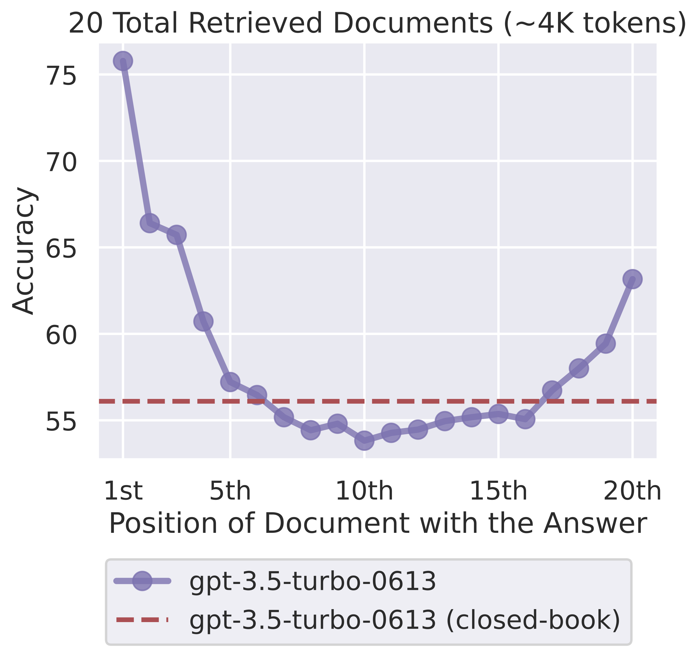
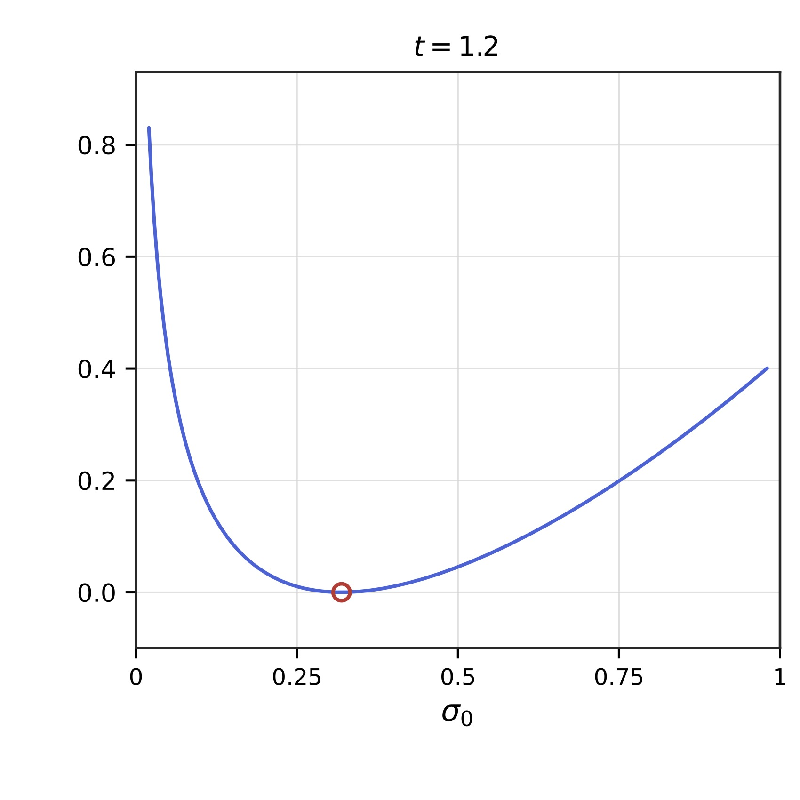

<!-- Title -->
<h1 align="center">
  Kinetic theory for Transformers and the lost-in-the-middle phenomenon
</h1>


<tt>Python</tt> codes for the paper 
**Kinetic theory for Transformers and the lost-in-the-middle phenomenon** by Mitia Duerincxk, Borjan Geshkovski and Stefano Rossi. 


<p align="center">
  
  
</p>


## Abstract

* We study causal self-attention dynamics -- a toy model for decoder Transformers -- which we interpret as a non-exchangeable interacting particle system. Adapting cumulant expansions to the triangular causal dependency structure of the model, and appealing to non-hierarchical methods to estimate correlations using Glauber calculus, we prove a quantitative mean-field limit result and a next-order characterization of correlations. For iid uniformly distributed tokens, the limiting correlation equation can be solved in closed form and we obtain a rigorous explanation of the empirically observed \emph{lost-in-the-middle} phenomenon: the token retrieval profile, as a function of the source position in the prompt, is 𝖴-shaped, with primacy, recency, and a unique interior minimum under an explicit smallness condition. 
*

## Citing

```bibtex
@article{duerinckx2026kinetictheorytransformerslostinthemiddle,
      title={Kinetic theory for Transformers and the lost-in-the-middle phenomenon}, 
      author={Mitia Duerinckx and Borjan Geshkovski and Stefano Rossi},
      year={2026},
      eprint={2605.09213},
      archivePrefix={arXiv},
      primaryClass={math.AP},
      url={https://arxiv.org/abs/2605.09213} 
}
```


